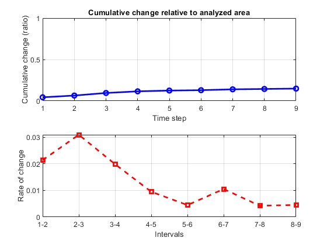

# Unsupervised Change Detection in Satellite Images using PCA and K-Means

This repository provides a MATLAB implementation of the unsupervised change detection algorithm described in:

> T. Celik, "Unsupervised Change Detection in Satellite Images Using Principal Component Analysis and k-Means Clustering," *IEEE Geoscience and Remote Sensing Letters*, vol. 6, no. 4, pp. 772-776, Oct. 2009.


<p align="center">
  
</p>


The algorithm combines **Principal Component Analysis (PCA)** with **K-Means clustering** to detect changes in multi-temporal satellite imagery. It is designed for analyzing already registered image sequences in different scenarios such as urbanization, deforestation, glacier melting, desiccation, or general change.

---

## 🚀 Features

* PCA-based feature extraction from blockwise image differences
* K-Means clustering for binary change detection
* Scene-specific masks for common applications (urbanization, vegetation loss, glacier retreat, water changes)
* Visualization: overlays, cumulative change plots
* Optional GIF export of temporal evolution

---

## 📂 Repository Structure

```
change-detection-pca-kmeans/
├── data/
│   ├── Brazil                    # Example dataset for deforestation
│   ├── Glacier Greenland         # Example dataset for glacier melting
│   └── Las Vegas/                # Example dataset for urbanization
├── examples/
│   ├── demoDeforestation.m       # Example demo script
│   ├── demoGlacierMelting.m      # Example demo script
│   └── demoUrbanization.m        # Example demo script
├── src/
│   ├── changeDetectionPCAKMeans.m   # Main algorithm
│   └── loadRegisteredImages.m       # Loader for registered image sequences
├── LICENSE
├── .gitignore
└── README.md
```

---

## ⚙️ Installation

### Requirements

* MATLAB R2022a or newer
* Image Processing Toolbox
* Statistics and Machine Learning Toolbox

```bash
git clone https://github.com/ertlmoritz/change-detection-pca-kmeans.git
cd change-detection-pca-kmeans
```

## Run Example

In MATLAB:

```matlab
cd examples
run demoUrbanization.m
```

This will:

* Load images from `data/urbanization`
* Run the PCA+KMeans change detection
* Show binary change masks
* Show cumulative change plots
* Overlay detected changes on the final image

---

## 🧑‍💻 Usage

### Loader function

```matlab
imgs = loadRegisteredImages(folderPath)
```

* Reads all `.png/.jpg/.tif` images from folder
* Sorts by `MM_YYYY` in filename
* Crops all images to common size
* Returns cell array of RGB images

### Core function

```matlab
[fullChangeMaps, nValidPixels, cumChanges, relGrowth] = ...
    changeDetectionPCAKMeans(imgs, scene, 'Name', Value,...)
```

**Inputs:**

* `imgs` : cell array of RGB images (same size, pre-registered)
* `scene` : one of `'urbanization' | 'deforestation' | 'glacier melting' | 'desiccation' | 'general'`

**Name-Value options:**

* `'folderPath'` : path to save GIF (default: '')
* `'h'` : block size for PCA (default: 2)
* `'S'` : number of PCA components (default: 3)
* `'doPlot'` : show binary masks (default: false)
* `'doGraph'` : plot cumulative change (default: false)
* `'delayTime'` : GIF frame delay in seconds (default: 1.0)

**Outputs:**

* `fullChangeMaps` : cell array of binary change masks
* `nValidPixels`   : number of valid pixels in analysis area
* `cumChanges`     : cumulative change ratio per time step
* `relGrowth`      : incremental change per step

---

## 📖 Citation

If you use this code, please cite the original paper:

```
@ARTICLE{5196726,
  author={Celik, Turgay},
  journal={IEEE Geoscience and Remote Sensing Letters}, 
  title={Unsupervised Change Detection in Satellite Images Using Principal Component Analysis and $k$-Means Clustering}, 
  year={2009},
  volume={6},
  number={4},
  pages={772-776},
  keywords={Satellites;Principal component analysis;Pixel;Image analysis;Data mining;Change detection algorithms;Radar detection;Parameter estimation;Euclidean distance;Optical devices;Change detection;$k$-means clustering;multitemporal satellite images;optical images;principal component analysis (PCA);remote sensing},
  doi={10.1109/LGRS.2009.2025059}}
```

---

## 📜 License
This project is licensed under the [MIT License](LICENSE).
